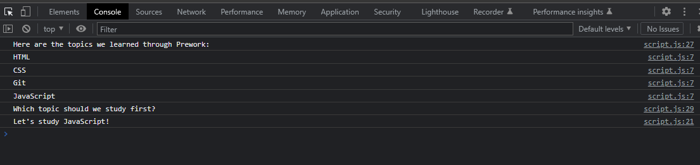

# Bootcamp Prework Study Guide

## Description

This project was to get us up to speed to be epic web developers.
The best way to learn is to do so by actually typing all aspects of web development out you learn faster. In this mini project we learned basic HTML, CSS and JavaScript. We also got introduced to version control and Cloud hosted source control.

## Table Of Contents

- [Installation](#installation)
- [Usage](#usage)
- [Credits](#credits)
- [License](#license)

## Installation

To get this up and running you are going to need a few things. First you need to instal [VSCode](https://code.visualstudio.com/), Then you are going to need to go to the VSCode extension shop and install Live Server and JavaScript extensions. Next you are going to need to clone the repo and open it in VScode. Finally right click on the index.html in VScode and select open with Live Server.

## Usage

how to live view[live view instruction](assets/live.png)

how to download via github[show how to download via github](assets/download.png)

## License

MIT Licenses

## Badges

## Features

Demostrates the use of basic html and css features. And basic JavaScript with flow control and functions

## How to Contribute

Its really easy to contribue. You can just for the repo make your changes and then make a pull request.

## Tests

There are two tests you can try.
If you go into the chrome console you can see if it has printed properly.

You can test them indivually by calling the functions.
function1[picture of function one and its output](assets/debug2.png)
function2[pictures of function two and its output](assets/debug3.png)